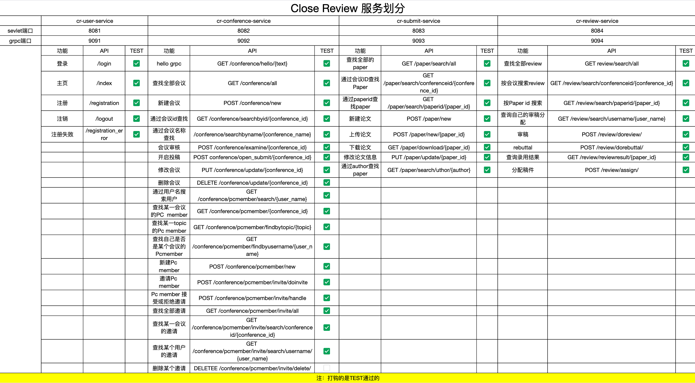
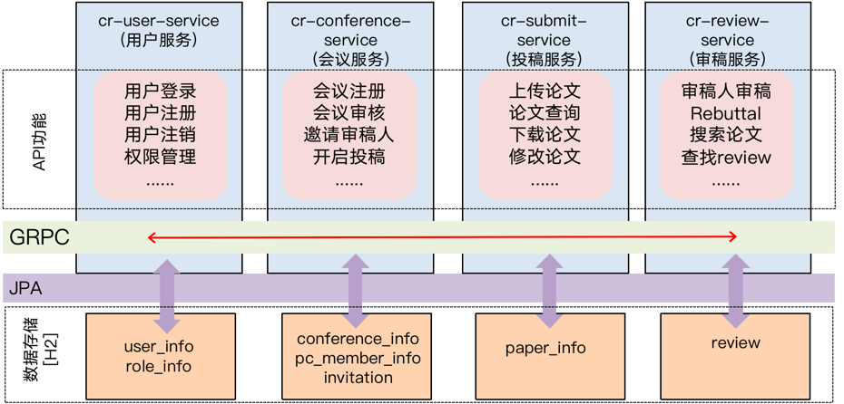

# Close Review

Close Review是一款基于Spring框架开发的论文投稿-审稿-会议管理web应用，是作者在探究微服务架构实践时的产物，其中实现了用户注册、登录、注销、论文投稿
审稿、稿件分配、会议管理等功能。使用了Spring Security进行身份验证，H2数据库以及JPA进行数据存储操作，并通过多个微服务实现了基本功能，达到了服务功能解耦的目的，
欢迎大家作为例子学习,顾及不到之处，欢迎提出issue指正。

## Requirement
#### 使用：
>* Java 17
#### 开发：
>* Mavean
>* Spring boot=3.1.4
>>SPRING 依赖：
>>* JPA
>>* H2
>>* Web
>>* spring security


## Usage

### 源码运行
```bash
#克隆本仓库的代码
git clone https://github.com/ssmisya/Close-Review.git
cd Close-Review
#安装grpc服务的依赖，从idea处安装也可以，点击右侧Maven图标，找到cr-grpc-service，双击install即可
sh ./cr-grpc-service/mvnw clean install
#开启后端(MacOS)
#这里需要启动四个服务的后端(cr-user-service/cr-conference-service/cr-submit-service/cr-review-service)
#此处建议从idea启动后端，idea的base为文件夹'Close-Review',防止它胡乱创建数据文件
#from 4 bashes
sh ./cr-user-service/mvnw clean spring-boot:run
sh ./cr-conference/mvnw clean spring-boot:run
sh ./cr-submit/mvnw clean spring-boot:run
sh ./cr-review-service/mvnw clean spring-boot:run
#cli进行测试或打开浏览器进行测试
curl -v localhost:8081/login
#postman进行测试
GET localhost:8082/conference/all
```

### docker运行

请从docker-compse.yaml启动

## 功能演示

CloseReview分为四个微服务：用户服务，会议服务，审稿服务和投稿服务，对应的接口如图所示，可以通过相应的url测试对应的接口



其中`cr-user-service`中的登录、注销、注册等实现了简单的前端页面，可以通过浏览器进行测试，而其他前端页面并非由作者进行开发，因此不适于在
此处开源，可以使用[Postman](https://www.postman.com/)进行测试或使用。也可以使用`curl -v XXX`命令进行测试。

## 实现细节
整个应用的架构如图所示

### 服务划分
CloseReview，是一个审稿程序的功能按照课上所说共划分为4个服务，分别是用户服务(cr-user-service),会议服务(cr-conference-service),
投稿服务(cr-submit-service)和审稿服务(cr-review-service)。这些web服务分别运行在8081/8082/8083/8084端口上。

### 数据操作
其中数据库也做了对应的拆分，用户服务的数据库共有两张表USER_INFO和USER_ROLE，分别存储用户信息和角色信息；会议服务的数据库共有三张表
，分别对应会议信息、PCmember信息和邀请信息；投稿服务有一张表，对应paper的信息；审稿服务有一张表，对应review的信息。所有的数据实体
全都在`src/main/java/entity`下。对应的数据仓库全都在repository下。

其中服务内的数据的操作全都使用JPA来完成，数据库采用H2数据库的文件持久化存储，避免每次重新加载。跨服务的数据操作采用GRPC来完成

### GRPC实现细节
`cr-grpc-service`中定义了GRPC服务的PROTOBUF消息格式，其他的服务通过导入Maven本地依赖的方式获取到消息格式，因此在运行前需要对`cr-grpc-service`
进行安装。然后分别对grpc服务端和客户端实现相应的方法即可。例如客户端想要获取服务端存储的某个信息的具体的流程为：客户端构造查询信息->客户端发送查询信息->服务端接收查询信息->
服务端通过JPA接口对信息进行查询->服务端构造返回结果信息->服务端发回返回结果信息->客户端接收结果。

### 用户登录和权限控制

用户登录采用了spring-security提供的接口，其中因为用户的表是自定义的，因此重写了`JdbcUserDetailsManager`这一spring security提供的原生的JDBC用户管理类，并重载了其中的adduser方法，以适应本项目定义的
数据格式（因为本项目数据库的数据表格式与默认的数据表格式有区别）。重写的文件为`cr-user-service/src/main/java/registration/MyjdbcUserDetailsManager`，
再通过这个类管理用户的登录和注册即可。

权限控制则是通过security登录后返回的信息创建一个JWT token，并将其返回给用户，用户在进行其他服务的时候就可以通过JWT token进行身份验证了


