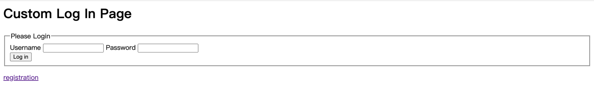
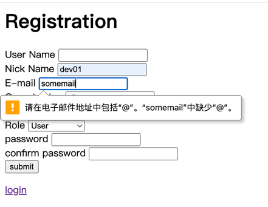

# LAB2

## 说明
本项目为在LAB1的基础上进行迭代的产物，因此与LAB1共用同一个code base，本codebase下有2个application，对应两个demo
，其中LAB2的demo为CloseReviewApplication，对应路径为`lab1_demo/src/main/java/CloseReview/CloseReviewApplication`

LAB1的demo为Application,对应路径为`lab1_demo/src/main/java/person/Application`。但是不保证完整可用，因为两个demo共用一个`application.properties`
,若想使用LAB1，请从`V1`分支下载。

项目文档也在本文档中，考虑到也没什么人看，就在这里一并写了。大家随时补充和修改。

## Requirement
#### 使用：
>* Java 17
#### 开发：
>* Mavean
>* Spring boot=3.1.4
>>SPRING 依赖：
>>* JPA
>>* H2
>>* Web
>>* spring security


## Usage

```bash
#克隆本仓库的代码
git clone git@codeup.aliyun.com:6507a61595afb811ce327e57/11.git
cd 11/lab1_demo
#切换到songmingyag_develop分支
git checkout songmingyang_develop
#开启后端(MacOS)
#此处建议从idea启动后端，idea的base为文件夹'11',防止它胡乱创建数据文件
sh ./mvnw clean spring-boot:run
#进行测试或使用浏览器进行测试
curl -v localhost:8080/
```

## 功能演示
#### 页面说明
>* `/`:主页(需要登录状态下才能查看)
>* `/login`:登录页面
>* `/registration`:注册页面
>* `/registration_error`:注册失败页面
>* `/H2`：数据库管理页面(需要管理员权限)
#### 登录
在未登录时，任何对非`/login`、`/registration`页面的访问都会被重定向到`/login`页面
，如图：

若登录失败，则会提示invalid,当你看到这个正在问候spring的神鹰黑手哥的时候，
就登录成功了。


#### 登出
点集下面的`logout`按钮即可登出，登出后又会被重定向到`/login`页面

#### 注册
点击各个页面下方的"registration"超链接会被重定向到注册页面：

注册会对用户名是否为空，电子邮件是否符合格式进行静态检查：

但对于两次Password输入不匹配、用户已存在、用户名为空字符串进行运行时检查，注册失败将会被重定向到
`registration_error`界面，注册成功将会被重定向到登录界面。

## 项目文档

### 开发者登录方式
为了能够进行查看和管理数据库，可以使用开发账号进行登录网站，

| 用户名    | dev          |
|--------|--------------|
| **密码** | **password** |

### 代码文件说明
```bash
src
├── main
│   ├── java
│   │   ├── CloseReview       #demo的代码文件
│   │   │   ├── CloseReviewApplication.java   #application文件
│   │   │   ├── develop                       #用于定义一些便于开发的页面，在安全策略中定义为仅有管理员才能查看
│   │   │   │   └── DevelopController.java    #便于开发的页面的控制器               
│   │   │   ├── registration                  #注册功能的相关代码实现
│   │   │   │   ├── Exception                 #注册功能有关的异常定义
│   │   │   │   │   ├── NullUserNameException.java
│   │   │   │   │   ├── PasswordNotMatchException.java
│   │   │   │   │   └── UserAlreadyExistException.java
│   │   │   │   ├── MyJdbcUserDetailsManager.java     #重写的JdbcUserDetailsManager，用于实现注册数据与数据库之间的连通
│   │   │   │   ├── RegistrationController.java       #注册页面的控制器
│   │   │   │   └── UserDto.java                      #用于暂存注册时用户提交的信息，并对用户提交的信息进行静态检查
│   │   │   ├── repository                            #实体仓库类的相关实现文件
│   │   │   │   ├── LoadDatabase.java                 #预加载数据库
│   │   │   │   ├── UserRepository.java               #用户实体仓库
│   │   │   │   └── UserRoleRepository.java           #用户角色实体仓库
│   │   │   ├── security                              #安全控制策略的相关配置和方法实现
│   │   │   │   ├── IndexController.java              #主页(/)的控制器
│   │   │   │   ├── LoginController.java              #登录页(/login)的控制器
│   │   │   │   ├── SecurityConfiguration.java        #安全策略控制（重要）
│   │   │   │   └── WebMvcConfiguration.java          #Mvc网页策略控制
│   │   │   ├── user                                  #用户实体类（数据格式定义处）
│   │   │   │   ├── User.java                         #表“user_info”的定义处
│   │   │   │   └── UserRole.java                     #表"usr_role"的定义处
│   │   │   └── util                                  #暂时没用
│   │   └── person                                    #LAB1的相关内容
│   │       └── ... 
│   └── resources   
│       ├── application.properties                    #app的定义文件
│       ├── static                                    #里面包含了css和js文件     
│       └── templates                                 #thmleaf模板文件
│           ├── addStudent.html
│           ├── index.html                            #主页
│           ├── login.html                            #登录页
│           ├── registration.html                     #注册页
│           ├── registration_error.html               #注册错误页
│           ├── searchStudent.html
│           ├── showAll.html
│           └── updateBook.html
└── test
    └── java
        ├── CloseReview
        │   └── JdbcCustomizeDatasourceApplicationTests.java  #数据源Datasource连通性的测试类
        └── person
            └── ...
```


### 数据存储方式

本次采用H2数据库进行存储，H2数据库有三种存储方式，内存型、服务器型、和文件型；
因为每次生成数据会对密码进行加密，因此采用文件型进行存储，数据文件在`lab1_demo/db/*`。

数据库可以进行UI查看，URL为`/H2`，需要使用Administer登录才可以查看，在其中可以方便地对标进行操作
由于demo采用的H2的数据库是内嵌的，因此可用JPA对其进行操作，即使用Entity的Repository来对其进行操作
即有两套scheme，是一一对应的关系。

当前共有两张表，User的数据的格式为：
```java
@Entity
@Table(name = "user_info")//使用user作为名字将导致报错，user是H2 SQL的保留字
public class User {

//    private static final long serialVersionUID = 3340373364530753417L;

    @Id
    @GeneratedValue(strategy = GenerationType.IDENTITY)
    private Long id;

    @Column(name = "user_name", columnDefinition = "varchar(100)", nullable = false, unique = true)
    private String userName;

    @Column(name = "nick_name", columnDefinition = "varchar(100)")
    private String nickName;

    @Column(name = "password", columnDefinition = "varchar(100)", nullable = false)
    private String password;

    @Column(name = "email", columnDefinition = "varchar(100)", nullable = false)
    private String email;

    @Column(name = "organization", columnDefinition = "varchar(100)", nullable = false)
    private String organization;

    @Column(name = "region", columnDefinition = "varchar(100)", nullable = false)
    private String region;

    @Column(name = "enabled", columnDefinition = "BOOL", nullable = false)
    private boolean enabled;
}
```

user_role的数据格式为：
```java
@Entity
@Table(name = "user_role")
public class UserRole {

    @Id
    @GeneratedValue(strategy = GenerationType.IDENTITY)
    private Long id;

    @Column(name = "user_name", columnDefinition = "varchar(100)", nullable = false)
    private String userName;

    @Column(name = "role", columnDefinition = "varchar(100)", length = 20, nullable = false)
    private String role;
}

```

### 安全验证策略


